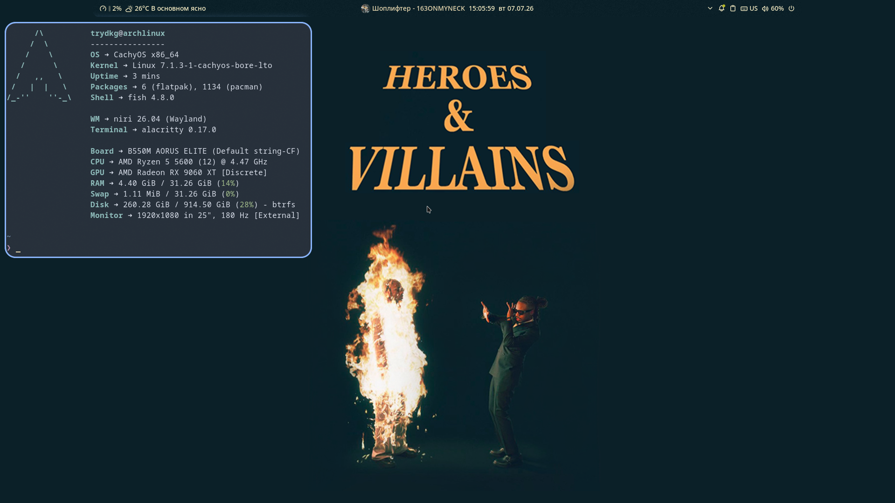

# TryDkg's Dotfiles

Personal Linux desktop configuration built for a fast, keyboard-driven workflow on Wayland.

This repository contains my daily configuration for **CachyOS**, **Niri**, and **Noctalia Shell**, including modular configuration files, application rules, workspace automation, gaming tweaks, and desktop customization.

---

# Screenshots

## Noctalia V5



## Previous Setup


---

# Environment

| Component | Value |
|-----------|-------|
| OS | CachyOS (Arch Linux) |
| Compositor | Niri |
| Shell | Fish |
| Desktop | Noctalia Shell V5 |
| Terminal | Alacritty |
| Display Server | Wayland |

---

# Hardware

| Component | Specification |
|-----------|---------------|
| CPU | AMD Ryzen 5 5600 |
| GPU | AMD Radeon RX 9060 XT 16GB |
| RAM | 32 GB DDR4 |
| Monitor | 1920×1080 • 180 Hz |

---

# Features

- Modular Niri configuration
- Noctalia Shell integration
- Wayland-first desktop
- Keyboard-driven workflow
- Workspace automation
- Steam workspace rules
- Application-specific rules
- Optimized animations
- Gaming-oriented desktop
- Performance-focused configuration

---

# Repository Structure

```
niri/
├── config.kdl
└── cfg/
    ├── animation.kdl
    ├── apps.kdl
    ├── autostart.kdl
    ├── display.kdl
    ├── input.kdl
    ├── keybinds.kdl
    ├── layout.kdl
    ├── misc.kdl
    ├── noctalia.kdl
    ├── rules.kdl
    └── steam.kdl

screenshots/
```

---

# Configuration Modules

| Module | Purpose |
|---------|---------|
| animation.kdl | Window animations |
| apps.kdl | Application rules |
| autostart.kdl | Startup applications |
| display.kdl | Monitor configuration |
| input.kdl | Keyboard and mouse |
| keybinds.kdl | Keyboard shortcuts |
| layout.kdl | Workspace layout |
| misc.kdl | General settings |
| noctalia.kdl | Noctalia integration |
| rules.kdl | Window rules |
| steam.kdl | Steam workspace behavior |

---

# Installed Software

## Desktop

- Niri
- Noctalia Shell
- SDDM

## Applications

- Florp
- Vesktop
- Spotify
- Nautilus
- AyuGram Desktop

---

# Installation

Clone the repository:

```bash
git clone https://github.com/TryDkg/TryDkg-s-dotfiles.git
```

Copy the configuration:

```bash
cp -r niri ~/.config/
```

Reload Niri or log in again.

---

# Goals

This repository serves as:

- Daily desktop configuration
- Backup
- Linux experimentation
- Git version control practice
- Technical portfolio

---

# Philosophy

- Fast
- Minimal
- Keyboard-first
- Wayland-native
- Performance-oriented
