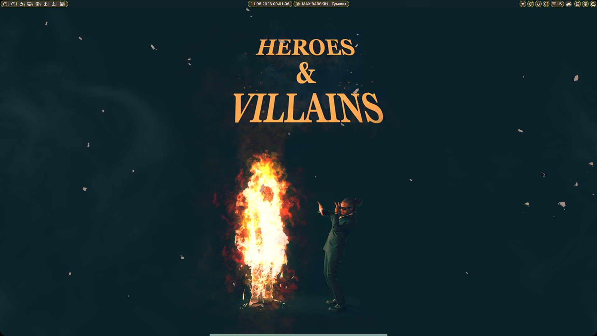

# TryDkg's Dotfiles

Personal Linux dotfiles and configuration files for my daily setup.

This repository contains my personal desktop configuration focused on performance, gaming, workflow optimization and Wayland.

---

## Screenshots



# System Information

## Operating System

* CachyOS (Arch-based)

## Desktop Environment / WM

* Niri (Wayland compositor)

## Terminal

* Alacritty

## Shell

* Bash

## Display Server

* Wayland

## Hardware

CPU:

```text
AMD Ryzen 5 5600
```

GPU:

```text
AMD Radeon RX 9060 XT 16GB
```

RAM:

```text
32GB DDR4 3600MT/s
```

Monitor:

```text
1920x1080 180Hz
```

---

# Repository Structure

```text
dotfiles/

├── niri/
│   ├── config.kdl
│   └── cfg/
│       ├── animation.kdl
│       ├── autostart.kdl
│       ├── display.kdl
│       ├── input.kdl
│       ├── keybinds.kdl
│       ├── layout.kdl
│       ├── misc.kdl
│       └── rules.kdl

└── README.md
```

---

# Features

## Niri Configuration

* Modular KDL configuration structure
* Separate configuration files for maintainability
* Workspace animations
* Blur effects
* Rounded corners
* Custom keybind workflow
* Wayland-first configuration

## Workflow

* Noctalia Shell integration
* Alacritty based workflow
* Gaming focused setup
* Multi-language keyboard layout
* Optimized for keyboard driven navigation

## Performance Related Configuration

* CachyOS Bore kernel
* AMDGPU + Mesa stack
* Wayland environment variables
* Performance oriented setup

---

# Installed / Used Software

## Desktop

* Niri
* Noctalia Shell
* SDDM

## Applications

* Firefox
* Vesktop
* Spotify
* Nautilus
* AyuGram

## Gaming

* Steam
* Proton
* Linux gaming environment

---

# Installation

Clone repository:

```bash
git clone https://github.com/TryDkg/TryDkg-s-dotfiles.git
```

Copy files manually:

```bash
cp -r niri ~/.config/
```

Or create symlinks if preferred.

---

# Goals

This repository exists for:

* Backup
* Learning Git / GitHub
* Sharing configuration files
* Tracking setup changes over time
* Building technical portfolio

---

# Notes

These configurations are built specifically for my workflow.

Things may break.

That is part of Linux.
